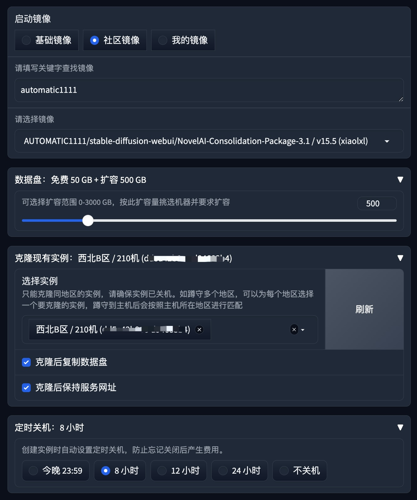
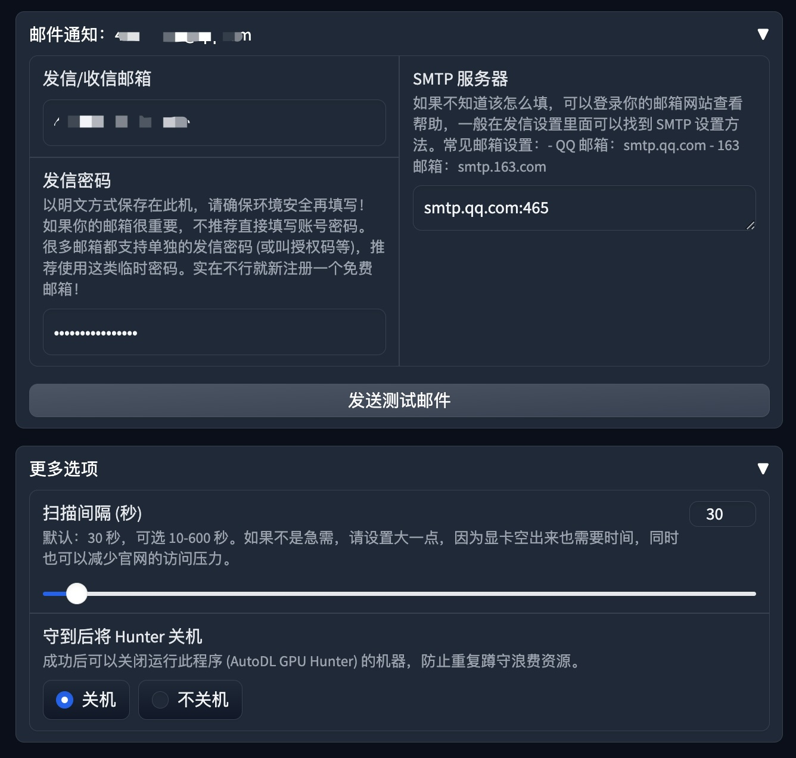

<!-- Thanks to https://github.com/othneildrew/Best-README-Template -->

<a name="readme-top"></a>
<div align="center">
  <a href="https://github.com/mfznttkx/autodl-gpuhunter/graphs/contributors"></a>
  <a href="https://github.com/mfznttkx/autodl-gpuhunter/network/members"></a>
  <a href="https://github.com/mfznttkx/autodl-gpuhunter/stargazers"></a>
  <a href="https://github.com/mfznttkx/autodl-gpuhunter/issues"></a>
  <a href="https://github.com/mfznttkx/autodl-gpuhunter/blob/master/LICENSE.txt"></a>
</div>

<div align="center">
    <br/><br/>
  <a href="https://github.com/mfznttkx/autodl-gpuhunter"></a>

  <h3 align="center">
    GPU Hunter for
    <a href="https://www.autodl.com/">AutoDL.com</a>
  </h3>

  <p align="center">
    这是一个帮你蹲守 AutoDL.com 显卡主机的工具。
    <br />
    This tool helps you reserve GPU machines on AutoDL.com.
    <br />
    <a href="#getting-started"><strong>快速入门 (Getting Started) »</strong></a>
    <br />
    <br />
    <a href="https://github.com/mfznttkx/autodl-gpuhunter/issues">汇报问题 (Report Bug)</a>
    ·
    <a href="https://github.com/mfznttkx/autodl-gpuhunter/issues">功能需求 (Request Feature)</a>
    ·
    <a href="https://github.com/mfznttkx/autodl-gpuhunter">注意事项 (Important Notes)</a>
  </p>
</div>

## 关于项目 (About The Project)

每当遇上 AutoDL.com 没卡的时候只能焦急地等待在电脑前，真不知道该去唱歌还是蹦迪。
这种情况，有一个自己的“卡蹲蹲”就十分必要了！拥有了这个工具，再也不会有意外的休息日，每天都有 996 的充实感！

此工具使用尊贵的 Gradio 框架为你打造了简单易用的 UI 界面，让你在不想敲命令行的时候可以优雅地按下鼠标即可启动，接下来小猴子会立马为你开始蹲守！而你该去唱歌就去唱歌，该去蹦迪就去蹦迪。

发现空闲的 GPU 主机后，小猴子会立即帮你拿下，并且还会发邮件通知你回来工作！甚至连自动关机的时间都帮你设定好了 ——
只为了给不方便回来的你带来一些方便，不会因为机器一直扣费而导致无法开心地唱歌或蹦迪！

### 所以，为什么需要这个工具 (Why)

* 急需 GPU！甚至比现在占用着全部 GPU 的那帮人更需要
* 需要一个手速飞快的猴子，帮我一直盯着随时都可能空闲出来的 GPU
* 抢到以后，要根据我的亿点点要求创建好直接能用的实例
* 我绝对不可能为这事花一毛钱

### 界面截图 (Screenshots)


<table>
  <tr>
  <td>
    
  </td>
  <td>
    
  </td>
  </tr>
</table>

<p align="right">(<a href="#readme-top">⬆️ TOP</a>)</p>

<a name="features"></a>

## 功能特点 (Features)

* **持续高效地帮你抢到 GPU (尤其在急需的时候)**
  * 启动后持续蹲守，不用人工刷新
  * 一旦有空闲的 GPU 主机就立即为你拿下
* **选项丰富，可满足多种要求**
  * 显卡型号、地区、GPU 个数
  * 租用数量
  * 启动镜像 (基础镜像/社区镜像/我的镜像)
  * 数据盘扩容
  * 克隆现有实例
  * 定时关机
  * 邮件通知
* **方便易用，简简单单**
  * 常见的 Python 环境即可安装，同时支持容器化部署——运行简单
  * 打出一条命令即可启动服务，按下一个按钮即可开始蹲守 (小学生都会) ——使用简单
  * 以 Gradio 作为界面框架的纯 Python 应用，但凡会炼模型的人都能改两下——修改简单
* **可全览 GPU 存量**
  * 通过“算力实况”功能可快速查看全站 GPU 主机的数量
* **开源免费**：
  * ？Why not
  * 祝你用得开心
  * 如果自己加了好用的专属功能，别忘了可以通过 [提交PR](https://github.com/mfznttkx/autodl-gpuhunter/pulls) 分享给大家，谢谢！

<p align="right">(<a href="#readme-top">⬆️ TOP</a>)</p>


<a name="getting-started"></a>

## 快速入门 (Getting Started)

下面演示了如何在本地配置这个项目，如需本地运行，请按照以下示例步骤操作。如果你熟悉 Docker，还可以制作成镜像并放到
AutoDL.com 或其它服务器上作为容器运行。

### 环境需求 (Prerequisites)

* [Python 3.8 或更高版本](https://www.python.org/downloads/)
* [venv](https://docs.python.org/3/library/venv.html) (可选)

### 安装步骤 (Installation)

在本地安装和配置这个项目的详细步骤如下，但这些步骤只介绍通用的系统和环境的情况，如果你的系统或环境比较特殊，或者使用了
venv，可以根据情况自己灵活处理。

1. 使用 git 克隆本仓库（或者[下载压缩包](https://github.com/mfznttkx/autodl-gpuhunter/archive/refs/heads/main.zip)）
   ```sh
   git clone https://github.com/mfznttkx/autodl-gpuhunter
   ```
2. 进入项目根目录
   ```sh
   cd autodl-gpuhunter
   ```
3. 使用 pip 命令安装依赖的库
   ```sh
   pip install -r requirements.txt
   ```
4. 启动服务
   ```sh
   python app.py
   ```

执行启动服务的命令后，即可从输出的信息中看到服务的网址，如：http://127.0.0.1:7860，在浏览器中打开该网址即可看到此工具的 UI 界面。

<p align="right">(<a href="#readme-top">⬆️ TOP</a>)</p>


<a name="usage"></a>

## 使用方法 (Usage)

### 1. 设置开发者 Token

首次使用时，需要你先登录 [AutoDL.com 控制台](https://www.autodl.com/console/center/settings/token) 获取你的**开发者 Token**
，然后回来按提示填入并点击“确定”。
此工具会将此 Token 临时保存在本地，以方便日常使用，你可以随时清除（请关注[注意事项](#important-notes)）。

### 2. 开始蹲守

1. 根据实际需要选择要蹲守的显卡型号、地区
2. 设置启动镜像、扩容数据盘、克隆实例，以及定时关机和邮件通知等
3. 按下“开始蹲守”按钮

以上设置会自动保存，所以通常只需直接按下“开始蹲守”即可！

<p align="right">(<a href="#readme-top">⬆️ TOP</a>)</p>


<a name="important-notes"></a>

## 注意事项 (Important Notes)

1. **登录超时问题**：看到“登录超时”的提示时，请先打开 [AutoDL.com](https://www.autodl.com)
   官网登录一下账号，然后返回点击“确定”即可。由于此工具调用的接口有一部分属于非公开的后台
   API，所以需要通过登录账号来激活这些接口的访问权限。
2. **请保管好你的密码**：无论是开发者 Token、还是邮箱的发信密码，请先确保本机安全可靠后再填写！同时，你还可以通过新建
   Token、使用单独 SMTP 密码等方式增加安全性。
3. **盯好已开机的实例**：此工具帮你快速创建 GPU 主机的实例，甚至还帮你设置了自动关机时间。但有些情况下还是会因为持续开机扣费而造成损失，所以请盯好已经开机的实例以防止没必要的浪费！
4. **注意这个选项**：“守到后将 Hunter 关机”的选项主要用于自动关闭在云端以容器方式运行的 GPU Hunter
   实例。如果需要在本地机器使用，请注意保存你在该机器上未完成的工作，防止机器被程序自动关闭而造成损失。

<p align="right">(<a href="#readme-top">⬆️ TOP</a>)</p>


<a name="roadmap"></a>

## 路线图 (Roadmap)

- [x] 确认可行性，测试和封装 AutoDL.com 的接口
- [x] 实现命令行版的蹲守功能
- [x] 实现 UI 界面 (设置显卡型号、地区、启动镜像，一键蹲守)
- [x] 实现必要的支持性功能 (克隆现有实例、定时关机、邮件通知等)
- [ ] 持续修复问题

如果你有更多的需求或想法，欢迎提出 [功能需求](https://github.com/mfznttkx/autodl-gpuhunter/issues)
或 [PR](https://github.com/mfznttkx/autodl-gpuhunter/pulls)！谢谢！

<p align="right">(<a href="#readme-top">⬆️ TOP</a>)</p>


<a name="acknowledgments"></a>

## 致谢 (Acknowledgments)

* [AutoDL.com](https://www.autodl.com/): AI算力云，弹性、好用、省钱
* [Gradio](https://github.com/gradio-app/gradio): Build and share delightful machine learning apps, all in Python
* [requests](https://github.com/psf/requests): An elegant and simple HTTP library for Python
* [retry](https://github.com/invl/retry): Easy to use retry decorator in python

<p align="right">(<a href="#readme-top">⬆️ TOP</a>)</p>
